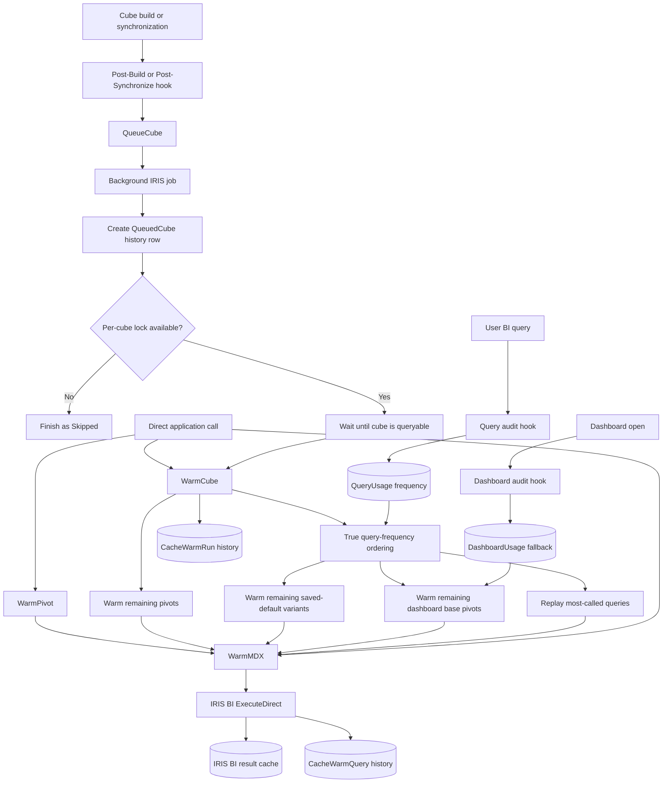

# DeepSee Cube Cache Warmer

[](https://pm.community.intersystems.com/packages/iris-bi-cube-cache-warmer)
[](https://openexchange.intersystems.com/package/deepsee-cube-cache-warmer)
[](https://github.com/josaliba/deepsee-cube-cache-warmer/actions/workflows/ci.yml)
[](LICENSE)

True query-frequency-aware cache warming for InterSystems IRIS Business Intelligence
(formerly DeepSee). The reusable `dc.bi.CubeCacheWarmer` package executes saved
dashboard and pivot queries after cube builds or synchronizations so IRIS can
repopulate its normal result cache before users open the dashboards.

This repository contains both:

- a standalone, application-neutral cache-warmer package under
  [`packages/cube-cache-warmer`](packages/cube-cache-warmer/README.md),
  described by the IPM [`module.xml`](module.xml) at the repository root; and
- a one-command Docker demo with two synchronized cubes, saved pivots, a
  dashboard with default filters, and tests.

Source and issues: <https://github.com/josaliba/deepsee-cube-cache-warmer>. Licensed under the [MIT License](LICENSE).

## Install the package with IPM

The module is published in the
[InterSystems community package registry](https://pm.community.intersystems.com/packages/iris-bi-cube-cache-warmer)
as `iris-bi-cube-cache-warmer`. From an ObjectScript terminal connected to the
target Analytics namespace:

```objectscript
zpm "install iris-bi-cube-cache-warmer"
```

Then set each cube's Cube Manager Post-Build and Post-Synchronize code to:

```objectscript
do ##class(dc.bi.CubeCacheWarmer.CacheWarmer).QueueCube("MyCube")
```

To install from a clone instead, for example to try unreleased changes, run
`zpm "load /path/to/deepsee-cube-cache-warmer"`. See
[deployment.md](docs/deployment.md) for source-based installation, upgrade,
verification, and uninstall.

## How it works



### Execution summary

1. After a cube build or synchronization, Cube Manager queues a background
   warmer:

   ```objectscript
   do ##class(dc.bi.CubeCacheWarmer.CacheWarmer).QueueCube("MyCube")
   ```

   Requests for the same cube are coalesced so concurrent hooks do not start
   overlapping warmers.
2. The worker waits until the cube is queryable. Running separately prevents
   warming from delaying Cube Manager or starting before the cube operation has
   fully finalized.
3. IRIS BI's `^DeepSee.AuditQueryCode` hook consumes new native
   `^DeepSee.QueryLog` entries and counts each normalized user query once.
   The warmer first replays distinct queries in descending real execution
   count, using last-executed time as the tie breaker. Its own replays are
   explicitly excluded, preventing a frequency feedback loop.
4. The warmer then discovers saved dashboards and pivots not already covered
   by those query keys. For each matching dashboard, it executes the saved pivot
   and, when applicable, a second query containing its saved default filters.
   Remaining saved pivots run afterward, while a case-insensitive in-memory set
   prevents duplicate base-pivot execution.
5. Executing the MDX through IRIS BI's standard result-set API repopulates its
   normal query cache, allowing compatible dashboard requests to reuse the
   cached results.
6. Every run and individual query result is saved persistently with timing,
   success or failure, row and column counts, real query frequency, actual
   execution order, dashboard attribution, and query type:

   - `dc_bi_CubeCacheWarmer_Model.CacheWarmRun`
   - `dc_bi_CubeCacheWarmer_Model.CacheWarmQuery`
   - `dc_bi_CubeCacheWarmer_Model.DashboardUsage`
   - `dc_bi_CubeCacheWarmer_Model.QueryUsage`

See [Architecture and execution flow](docs/architecture.md) for the detailed
behavior of each path, including concurrency, dashboard ranking, and outcomes.

## Features

- Background warming from Cube Manager Post-Build and Post-Synchronize hooks.
- Per-cube worker coalescing so duplicate hooks do not run the same workload
  concurrently.
- Cube-availability waiting before MDX execution.
- True normalized-query frequency tracking through `^DeepSee.AuditQueryCode`.
- Most-called-query-first execution, with recency as a deterministic tie breaker.
- Dashboard-open and `lastAccessed` ordering as the zero-frequency fallback.
- Saved base-pivot and dashboard-default query warming.
- Support for subject areas, static defaults, `@` runtime settings, sets, and
  `%NOT` filter values.
- Persistent run history plus replayable query-frequency data. Query usage
  stores resolved MDX, so its access and retention must be treated accordingly.
- Direct APIs for warming a cube, pivot, or arbitrary MDX.
- IPM and source-based deployment options.

## Compatibility

The standalone package is verified on InterSystems IRIS 2025.1.5 and 2026.1.
The Docker demo builds on the `intersystemsdc/iris-community:latest-em` image,
currently IRIS 2026.1 Community Edition, and its CI run covers the image build,
both test suites, cube builds, saved dashboard and pivot creation, and cache
warming.

The checked-in Cube Manager registry deliberately uses the legacy registry
model supported by IRIS 2025.1. Newer IRIS releases automatically upgrade that
model in the compiled namespace; the same source has also been verified through
that upgrade path on IRIS 2026.1.

## Repository layout

```text
module.xml                 IPM module definition for the standalone package
LICENSE                    MIT License
packages/cube-cache-warmer/  Standalone package sources and unit tests
src/Demo/                  Demo models, cubes, registry, and helpers
tests/Demo/                Demo smoke and cube-registry tests
Dockerfile, compose.yaml   Demo container definition
iris.script                Build-time setup: IPM load, demo import, cube builds
docs/                      Demo, architecture, deployment, and operations guides
```

## Quick start

### Prerequisites

- [Docker Desktop](https://www.docker.com/products/docker-desktop/), or Docker
  Engine with the Compose plugin
- Git

Every command below is the same in PowerShell, Command Prompt, WSL, and bash.

### Build and start

```bash
git clone https://github.com/josaliba/deepsee-cube-cache-warmer.git
cd deepsee-cube-cache-warmer
docker compose up -d --build --wait
```

The image build installs the cache warmer through IPM, enables Analytics for
the `USER` namespace, loads the demo application, creates 50 patients and 500
diagnoses, builds both cubes, saves two pivots and one dashboard, and warms
their queries. The first build takes a few minutes. The command returns once
IRIS reports healthy, and the demo is then complete.

### Explore the demo

- Management Portal: <http://localhost:52773/csp/sys/UtilHome.csp>
- Analytics user portal: <http://localhost:52773/csp/user/_DeepSee.UserPortal.Home.zen>
- IRIS SuperServer: `localhost:1972`
- Namespace: `USER`
- Username `_SYSTEM`, password `SYS`

Open an ObjectScript terminal in the demo namespace:

```bash
docker compose exec iris iris session IRIS -U USER
```

Run the package and demo test suites:

```bash
docker compose exec iris iris session IRIS -U USER "##class(Demo.Util.Tests).RunAll()"
```

Recreate the demo content at any time from the terminal:

```objectscript
set sc=##class(Demo.Util.Analytics).SetupDemo(50,500,1,1)
do $SYSTEM.OBJ.DisplayError(sc)
```

The credentials and the HTTP-only web server are intended only for an isolated
development workstation.

## Documentation

- [Install and run the demo](docs/demo.md)
- [Architecture and execution flow](docs/architecture.md)
- [Deploy and upgrade the standalone package](docs/deployment.md)
- [Operate, monitor, and troubleshoot the warmer](docs/operations.md)
- [Standalone package reference](packages/cube-cache-warmer/README.md)

## Build the distributable package

IPM packages the module from the root `module.xml`. In the demo terminal, run:

```objectscript
zpm "package iris-bi-cube-cache-warmer -path /home/irisowner/dev/dist/iris-bi-cube-cache-warmer-1.0.0"
```

This writes `dist/iris-bi-cube-cache-warmer-1.0.0.tgz` into the repository
checkout, where Git ignores it. The archive holds the package sources and a
`module.xml`, so an extracted copy loads with `zpm "load <directory>"`. See
[deployment.md](docs/deployment.md) for IPM installation, source-based
installation, Cube Manager configuration, upgrade, verification, and uninstall
instructions.

## Common development commands

```bash
docker compose up -d --build --wait   # Build the image and start the demo
docker compose logs -f iris           # Follow IRIS logs
docker compose exec iris iris session IRIS -U USER                                    # Terminal
docker compose exec iris iris session IRIS -U USER "##class(Demo.Util.Tests).RunAll()"  # Tests
docker compose stop                   # Stop the container and keep its state
docker compose down                   # Remove the container; the next start is a fresh demo
docker compose build --pull           # Rebuild on the newest community image
```

The demo keeps no Docker volume. Stopping and starting preserves data inside
the container, while `docker compose down` discards it and the next `up`
recreates the demo from the image. Community Edition images carry a license
that expires, so rebuild with `--pull` when a cached image refuses to start.

## Configuration and security

Copy `.env.example` to `.env` to override the image tag or the host ports, for
example when a local IRIS instance already uses port 1972.

The `.env` file, generated archives, and local editor settings are excluded
from Git. Do not commit credentials or other sensitive material.

Before production deployment, review authentication, TLS, authorization,
licensing, auditing, backups, data retention, resource limits, and applicable
healthcare privacy requirements. Cache warming consumes CPU and I/O; deploy a
deliberate workload rather than attempting to warm every possible user filter.

## License

This project is released under the [MIT License](LICENSE). The demo runs on
InterSystems IRIS Community Edition, which carries its own license terms; review
the target IRIS licensing before deploying the package elsewhere.
