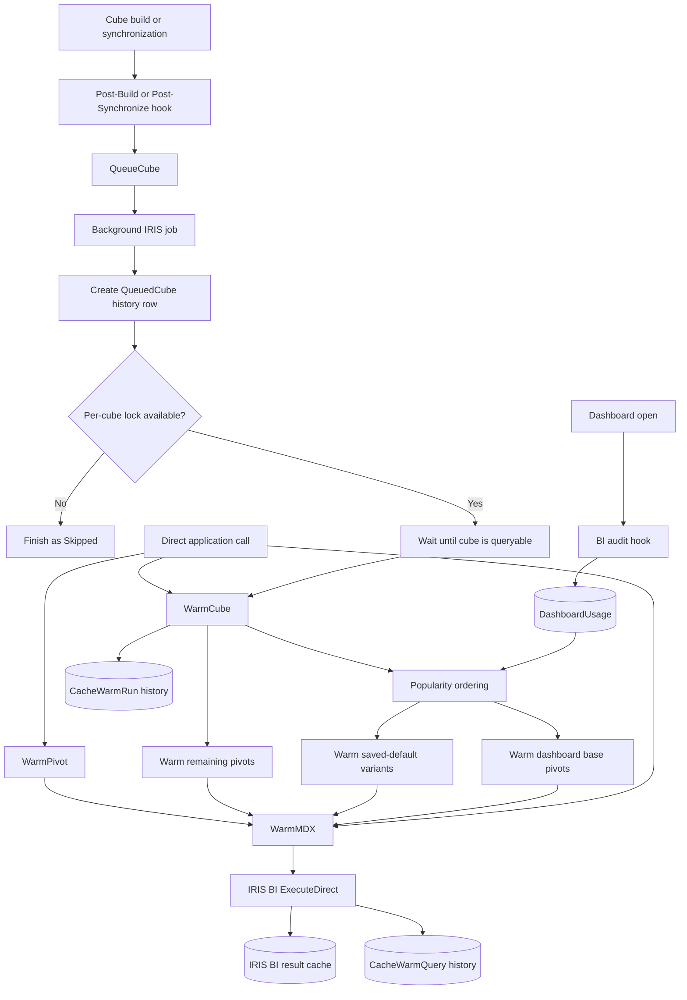

# DeepSee Cube Cache Warmer

Popularity-aware cache warming for InterSystems IRIS Business Intelligence
(formerly DeepSee). The reusable `DHA.BI.CubeCacheWarmer` package executes saved
dashboard and pivot queries after cube builds or synchronizations so IRIS can
repopulate its normal result cache before users open the dashboards.

This repository contains both:

- a standalone, application-neutral cache-warmer package under
  [`packages/dha-bi-cube-cache-warmer`](packages/dha-bi-cube-cache-warmer/README.md);
  and
- a complete Docker Compose disease-registry demo with two synchronized cubes,
  saved pivots, a dashboard with default filters, tests, and operational helpers.

## How it works



### Execution summary

1. After a cube build or synchronization, Cube Manager queues a background
   warmer:

   ```objectscript
   do ##class(DHA.BI.CubeCacheWarmer.CacheWarmer).QueueCube("MyCube")
   ```

   Requests for the same cube are coalesced so concurrent hooks do not start
   overlapping warmers.
2. The worker waits until the cube is queryable. Running separately prevents
   warming from delaying Cube Manager or starting before the cube operation has
   fully finalized.
3. The warmer discovers saved dashboards and pivots for the cube and its
   matching subject areas. Dashboards are prioritized by usage: the
   `^DeepSee.AuditCode` hook records dashboard opens, so frequently used
   dashboards run first. IRIS BI's existing `lastAccessed` timestamp and the
   dashboard name provide fallback ordering.
4. For each matching dashboard, the warmer executes the underlying saved pivot
   and, when applicable, a second query containing its saved default filters.
   Remaining saved pivots run afterward, while a case-insensitive in-memory set
   prevents duplicate base-pivot execution.
5. Executing the MDX through IRIS BI's standard result-set API repopulates its
   normal query cache, allowing compatible dashboard requests to reuse the
   cached results.
6. Every run and individual query result is saved persistently with timing,
   success or failure, row and column counts, dashboard priority, and query
   type:

   - `DHA_BI_CubeCacheWarmer_Model.CacheWarmRun`
   - `DHA_BI_CubeCacheWarmer_Model.CacheWarmQuery`
   - `DHA_BI_CubeCacheWarmer_Model.DashboardUsage`

See [Architecture and execution flow](docs/architecture.md) for the detailed
behavior of each path, including concurrency, dashboard ranking, and outcomes.

## Features

- Background warming from Cube Manager Post-Build and Post-Synchronize hooks.
- Per-cube worker coalescing so duplicate hooks do not run the same workload
  concurrently.
- Cube-availability waiting before MDX execution.
- Dashboard popularity tracking through IRIS BI's `^DeepSee.AuditCode` hook.
- Dashboard ordering by observed opens, then BI `lastAccessed`, then name.
- Saved base-pivot and dashboard-default query warming.
- Support for subject areas, static defaults, `@` runtime settings, sets, and
  `%NOT` filter values.
- Persistent run and per-query history without storing MDX, parameters, filter
  values, URLs, or usernames.
- Direct APIs for warming a cube, pivot, or arbitrary MDX.
- IPM and source-based deployment options.

## Repository layout

```text
packages/dha-bi-cube-cache-warmer/  Standalone package, tests, and module.xml
src/DiseaseRegistry/                Demo models, cubes, registry, and helpers
tests/DiseaseRegistry/              Demo smoke and cube-registry tests
docker/                             Fresh-volume bootstrap and installer
bin/                                Start, stop, test, terminal, and package scripts
docs/                               Demo, architecture, deployment, and operations guides
```

## Quick start

### Prerequisites

- Docker Desktop with Docker Compose v2
- Git
- Network access to `containers.intersystems.com`

Clone the repository and enter it:

```bash
git clone git@gitlab.iscinternal.com:jsaliba/deepsee-cube-cache-warmer.git
cd deepsee-cube-cache-warmer
```

The default [`iris-community:latest-em`](https://docs.intersystems.com/irislatest/csp/docbook/DocBook.UI.Page.cls?KEY=ACLOUD)
image is public and includes a Community Edition license, so no external IRIS
key is required. Authenticate to the InterSystems Container Registry only if
access to the separate Web Gateway image requires it, then start the stack:

```bash
docker login containers.intersystems.com
./bin/start
./bin/logs
```

The start command returns after the containers start; first-time IRIS bootstrap
continues asynchronously. Wait until the logs show:

```text
Disease Registry bootstrap complete.
```

Then open an IRIS terminal and create the deterministic demo:

```bash
./bin/terminal
```

```objectscript
set sc=##class(DiseaseRegistry.Util.Analytics).SetupDemo(50,500,1,1)
do $SYSTEM.OBJ.DisplayError(sc)
```

This creates 50 patients and 500 diagnoses, builds both cubes, creates two saved
pivots and one dashboard, and warms three queries.

Run all package and application tests:

```bash
./bin/test
```

Local endpoints and development credentials:

- Management Portal: <http://localhost:52773/csp/sys/UtilHome.csp>
- IRIS SuperServer: `localhost:1972`
- Namespace: `DISEASEREGISTRY`
- Development user: `_SYSTEM`
- Development password: `SYS`

These credentials and the HTTP-only Web Gateway configuration are intended only
for an isolated development workstation.

## Documentation

- [Install and run the demo](docs/demo.md)
- [Architecture and execution flow](docs/architecture.md)
- [Deploy and upgrade the standalone package](docs/deployment.md)
- [Operate, monitor, and troubleshoot the warmer](docs/operations.md)
- [Standalone package reference](packages/dha-bi-cube-cache-warmer/README.md)

## Build the distributable package

Create a versioned archive from the version in `module.xml`:

```bash
./bin/package-cache-warmer
```

The script writes an ignored archive such as:

```text
dist/dha-bi-cube-cache-warmer-1.0.0.tar.gz
```

See [deployment.md](docs/deployment.md) for IPM installation, source-based
installation, Cube Manager configuration, upgrade, verification, and uninstall
instructions.

## Common development commands

```bash
./bin/start                    # Build and start the demo stack
./bin/logs                     # Follow IRIS/bootstrap logs
./bin/terminal                 # Open DISEASEREGISTRY ObjectScript terminal
./bin/test                     # Compile and run package and demo tests
./bin/package-cache-warmer     # Create the standalone package archive
./bin/stop                     # Stop containers and preserve their volumes
docker compose down -v         # Delete containers and all local demo data
```

The final command permanently deletes the project's IRIS and Web Gateway named
volumes. Use it only when a completely fresh installation is required.

## Configuration and security

Copy `.env.example` to `.env` to override image tags or host ports. Pin the IRIS
and Web Gateway images to matching explicit versions before using the demo as a
long-lived environment.

The `.env` file, generated archives, runtime data, and local editor settings are
excluded from Git. Do not commit credentials or other sensitive material.

Before production deployment, review authentication, TLS, authorization,
licensing, auditing, backups, data retention, resource limits, and applicable
healthcare privacy requirements. Cache warming consumes CPU and I/O; deploy a
deliberate workload rather than attempting to warm every possible user filter.

No external redistribution license is included in this repository. Add or
confirm the license required by your organization before publishing the package
outside its intended environment.
