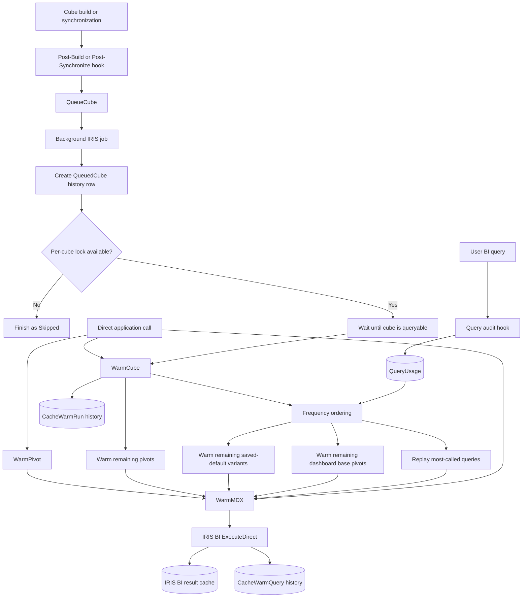

# Architecture and execution flow

`dha.bi.CubeCacheWarmer` executes real IRIS BI MDX queries so IRIS repopulates
its standard result cache. It does not implement or store a separate cache.

## High-level flow



## Components

| Class | Responsibility |
| --- | --- |
| `dha.bi.CubeCacheWarmer.CacheWarmer` | Queueing, worker coalescing, discovery, MDX execution, statistics, and retention |
| `dha.bi.CubeCacheWarmer.DashboardUsage` | Installation and execution of the dashboard-open audit hook |
| `dha.bi.CubeCacheWarmer.QueryUsage` | Query-audit installation, normalized frequency counting, and native-log import |
| `dha.bi.CubeCacheWarmer.Installer` | Package lifecycle entry points |
| `Model.CacheWarmRun` | One persistent row per warmer invocation |
| `Model.CacheWarmQuery` | One child row per executed MDX query |
| `Model.DashboardUsage` | Aggregate dashboard-open count and timestamps |
| `Model.QueryUsage` | Normalized query key, replayable MDX, execution count, and first/last timestamps |

All package globals use the `^DHABICCW` prefix and are stored in the target
namespace's database.

## Trigger paths

### Queued cube warming

Configure both Cube Manager Post-Build and Post-Synchronize code with:

```objectscript
do ##class(dha.bi.CubeCacheWarmer.CacheWarmer).QueueCube("MyCube")
```

`QueueCube()` validates its inputs and starts `WarmWhenAvailable()` in a separate
IRIS `JOB`. The Cube Manager process does not wait for the MDX workload.

The background worker creates a `QueuedCube` run before attempting the per-cube
lock. This makes coalesced attempts visible in history.

### Direct warming

Applications and administrators can call:

- `WarmCube()` for every relevant dashboard and saved pivot query.
- `WarmPivot()` for one saved pivot.
- `WarmMDX()` for arbitrary MDX.

Direct calls execute synchronously and return their status and statistics to the
caller.

## Per-cube concurrency and availability

The worker takes this logical lock:

```objectscript
^DHABICCW.CacheWarmerLock("cube",uppercaseCubeName)
```

The lock has a zero-second timeout. Only one process can wait for and warm a
given cube. A concurrent worker finishes as `Skipped` rather than duplicating
the workload. Different cubes have independent lock keys and can warm in
parallel.

The winning worker calls `%DeepSee.Utils.%IsCubeAvailable()` once per second for
up to 600 seconds by default. It holds the warmer lock during this wait, so later
duplicates are coalesced. A timeout becomes a failed run with the cube's
availability reason.

## Cube and subject-area matching

`WarmCube()` first resolves the requested logical cube name. When the target is
a physical cube, the warmer includes saved pivots attached to subject areas
whose base cube is that target. When the target itself is a subject area, only
that subject area is matched.

## True query-frequency ranking

IRIS BI calls the package through `^DeepSee.AuditQueryCode` after query
executions. The recorder consumes each new entry in the native
`^DeepSee.QueryLog`, prepares its MDX without executing it, obtains IRIS BI's
normalized query key and cube, and increments `QueryUsage.ExecutionCount`.
Per-user sequence checkpoints ensure each native log entry is counted once.
Equivalent executions with the same query key therefore contribute to one
frequency record.

`WarmCube()` executes matching query-usage rows in this order:

1. `ExecutionCount` descending.
2. `LastExecutedAt` descending.
3. Query key ascending as a deterministic tie breaker.

The replay is marked in a process-private global. Its audit callback advances
the native-log checkpoint without incrementing frequency, so warming never
increases its own score. The warmed query-key set also prevents the later
dashboard and pivot fallback phases from executing an already replayed query.

The package can seed counts from `^DeepSee.QueryLog` using
`QueryUsage.ImportQueryLog()`. Because that native global contains MDX and has
no source marker, import is explicit rather than automatic and should normally
be performed once.

## Dashboard fallback ranking

Dashboards are ordered by:

1. `DashboardUsage.OpenCount` descending.
2. IRIS BI dashboard `lastAccessed` descending.
3. Dashboard name ascending as a stable tie-breaker.

Dashboard usage orders only candidates with no observed query frequency. Every
matching saved pivot is still considered.

The audit hook stores only dashboard name, open count, and first/last timestamps.
It does not store usernames, URLs, MDX, parameters, or filter values.

Usage recording has a separate zero-wait lock per dashboard. A simultaneous
open can be omitted from the count rather than making either dashboard request
wait. Tracking exceptions are swallowed by design so telemetry cannot interrupt
a dashboard request.

## Dashboard query discovery

For each dashboard, the warmer:

1. Reads widget names, data sources, and saved `filterState` values.
2. Reads `applyFilter`, `setFilter`, and default-action controls.
3. Resolves whether each control targets its owner, all widgets, or named
   widgets.
4. Resolves values beginning with `@` through IRIS BI user settings in the
   worker's user and security context.
5. Keeps only `.pivot` data sources matching the requested cube.
6. Validates that the pivot exists and is an IRIS BI pivot.
7. Warms the saved base MDX once per pivot.
8. Builds and warms a second MDX query when applicable defaults exist.

A case-insensitive in-memory set prevents a base pivot shared by multiple
widgets or dashboards from being executed more than once in a cube run. The
highest-priority dashboard referencing that pivot supplies its attribution.

## Default-filter construction

Before applying defaults, the warmer asks IRIS BI for the filter levels valid
for the pivot. Dashboard controls that do not apply to the data source are
ignored.

Supported saved forms include:

- scalar values, qualified and escaped as members;
- existing `&[...]` member expressions;
- member sets such as `{&[One],&[Two]}`;
- multi-member OR expressions; and
- `%NOT` values.

Multiple applicable filters are combined into nested `NONEMPTYCROSSJOIN`
expressions and appended as one `%FILTER` clause. This reproduces the important
saved opening defaults without trying to predict interactive selections.

The automatic warmer does not cover arbitrary URL filters, later interactions,
or every per-user override. High-value parameter combinations outside the saved
opening state should be warmed explicitly with `WarmPivot()` or `WarmMDX()`.

## Remaining saved pivots

After frequency and dashboard queries, the warmer enumerates all saved pivots
belonging to the cube or its subject areas. Pivots whose normalized query key
was already warmed are skipped; unreferenced pivots run afterward.

## MDX execution and caching

Every path eventually calls:

```objectscript
##class(%DeepSee.ResultSet).%ExecuteDirect(mdx,.parameters,.status)
```

IRIS BI result caching is enabled by default. Successful execution produces a
query key, result dimensions, and elapsed time. The result object is released,
while the server-side BI cache remains available for compatible subsequent
queries.

IRIS manages cache identity, reuse, and invalidation. Cube builds or
synchronizations can invalidate results; the post-operation hooks repopulate
the selected workload.

## Run modes and query source types

Run `Mode` describes how an invocation began:

| Mode | Meaning |
| --- | --- |
| `QueuedCube` | Background worker started by `QueueCube()` |
| `DirectCube` | Synchronous `WarmCube()` call without an existing run ID |
| `DirectPivot` | Synchronous `WarmPivot()` call |
| `DirectMDX` | Synchronous `WarmMDX()` call |

Child query `SourceType` describes what was executed:

| Source type | Meaning |
| --- | --- |
| `DashboardBase` | A saved pivot first discovered through a dashboard widget |
| `DashboardDefault` | That widget's saved opening-default variant |
| `QueryFrequency` | A real observed query replayed in descending frequency order |
| `BasePivot` | A saved pivot not already executed through a dashboard |
| `Pivot` | A direct `WarmPivot()` invocation |
| `AdHocMDX` | A direct `WarmMDX()` invocation |

## History and outcomes

A run begins as `Running`. Each executed query writes a `CacheWarmQuery` child
containing attribution, counts, timing, generated query key, frequency, actual
execution order, and status. Run history does not store query text, but
`Model.QueryUsage` stores resolved MDX because replay requires it. Access and
retention for that model must account for potentially sensitive filter members.

Final outcomes are:

| Outcome | Meaning |
| --- | --- |
| `Success` | Overall status succeeded and no enumeration/configuration errors occurred |
| `PartialFailure` | At least one query succeeded, but another query or enumeration step failed |
| `Failure` | The cube was unavailable, all relevant work failed, or no query succeeded after an error |
| `Skipped` | Another queued worker already owned the cube lock |
| `Running` | The invocation has not finalized; a stale row can indicate abnormal worker termination |

With `pStopOnError=0`, query failures are aggregated and warming continues. With
`pStopOnError=1`, the cube run stops after its first MDX execution failure.
Enumeration errors are counted and logged while discovery continues where
possible.

History writes are best-effort. A history failure is logged but does not prevent
MDX execution.

## Demo-specific ordering

`SetupDemo()` builds cubes before it creates the saved pivots and dashboard.
Build hooks can therefore produce successful `QueuedCube` runs with zero
queries during the first demo setup. After creating BI content, `SetupDemo()`
calls `WarmCube()` directly for both cubes, producing the `DirectCube` runs that
warm the three demo queries.
